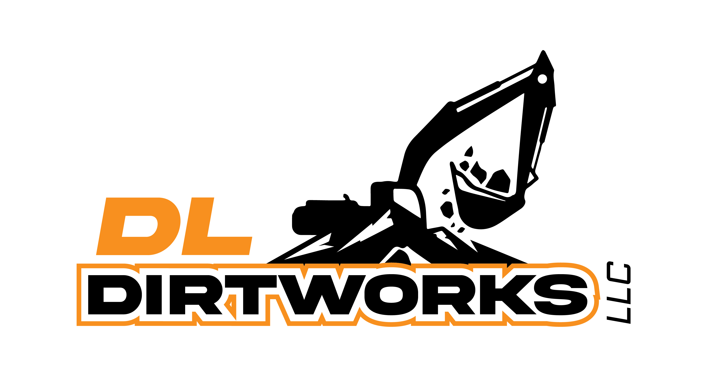

## About DL Dirtworks LLC

DL Dirtworks LLC is a licensed and insured general contractor with a B100 license, according to the state of Utah requirements.

Built on honesty and quality work, we proudly serve Utah with any excavation, demolition, grading, land clearing, cabin pads, roads and more. 

Based out of Sanpete County, UT we will gladly take care of any excavation needs you may have. 
